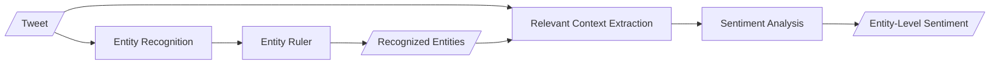

# entity-sentiment-soccer
Entity-Level Sentiment Analysis for Soccer Tweets

Workflow Illustration:

```mermaid
graph LR
    A[/Tweet/] --> B[Entity Recognition]
    B --> C[Entity Ruler]
    C --> D[/Recognized Entities/]
    A --> E[Relevant Context Extraction]
    E --> F[Sentiment Analysis]
    F --> G[/Entity-Level Sentiment/]
    D --> E
```
