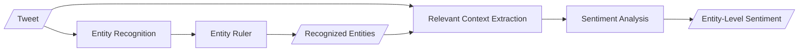

# entity-sentiment-soccer
Entity-Level Sentiment Analysis for Soccer Tweets

Workflow Illustration:


The fine-tuned NER model is on [wangzes-kevo/soccer-tweet-ner](https://huggingface.co/wangzes-kevo/soccer-tweet-ner).\
The fine-tuned sentiment model is on [wangzes-kevo/soccer-tweet-sentiment](https://huggingface.co/wangzes-kevo/soccer-tweet-sentiment).


# Example Usage
```Python
import pipeline
import utils


texts = ["text1", "text2", "text3"]
# preprocess the texts
preprocessed = [utils.remove_emojis(utils.preprocess(text)) for text in texts]

# 1
# use the models in '../models/ckpt_sentiment/best_model' & '../models/ckpt_ner/best_model'
model = pipeline.EntitySentimentModel(
    is_local_ner=True,
    is_local_sentiment=True,
    use_crf=True,
    half_window_size=10
)
# get entity ruler data
pattern_paths = utils.get_json_file_paths('../data/entity_ruler_data/')
# build the pipeline
model.build_pipeline(use_entity_ruler=True, pattern_paths=pattern_paths)

result = model.summarize(preprocessed)

# 2
# use the models on hugging face
model = pipeline.EntitySentimentModel(
    ner_model_name='wangzes-kevo/soccer-tweet-ner',
    sentiment_model_name='wangzes-kevo/soccer-tweet-sentiment',
    is_local_ner=False,
    is_local_sentiment=False,
    use_crf=True,
    half_window_size=10
)
# get entity ruler data
pattern_paths = utils.get_json_file_paths('../data/entity_ruler_data/')
# build the pipeline
model.build_pipeline(use_entity_ruler=True, pattern_paths=pattern_paths)

result = model.summarize(preprocessed)
```
